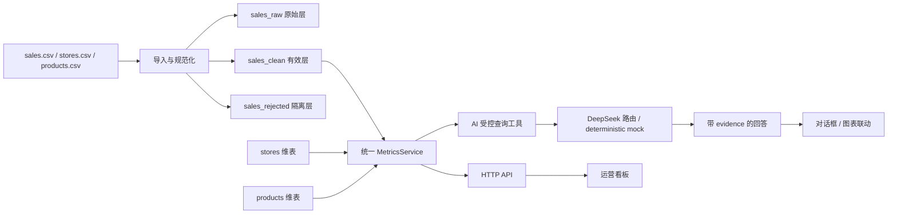

# Moneki Ops

连锁餐饮经营看板 + 可信 AI 数据问答。看板和 AI 助手共用一套 SQLite 查询服务：模型只能选择受控工具和参数，所有金额、订单数和客单价都由数据库查询产生。

## 三步启动

需要 Python 3.11+，不需要安装第三方 Python 包。

```bash
cd moneki-fullstack-assignment
python run.py
```

打开 <http://127.0.0.1:8000>。

如需 Docker：

```bash
docker compose up --build
```

中国大陆网络若无法连接 Docker Hub，可临时使用镜像代理：

```powershell
$env:PYTHON_IMAGE="docker.m.daocloud.io/library/python:3.12-slim"
docker compose up --build
```

有 DeepSeek Key 时，先设置 `DEEPSEEK_API_KEY`。没有 Key 时默认使用 deterministic mock router；它仍然执行同一套真实数据库工具调用，只是不调用外部大模型，适合评审离线运行。

## 功能验收

- 日期区间筛选：返回每日营业额、订单数、客单价，并补齐没有销售的日期。
- Top 10 商品：通过 `sales_clean JOIN products` 取得商品名称和品类。
- 门店对比：通过 `sales_clean JOIN stores` 取得门店名称、经营品类和区域。
- AI 真实取数：支持“哪个品类的门店营业额最高？”、“牛肉poke 六月卖了多少钱？”、“客单价最近是涨了还是跌了？”。
- 对话追问：例如先问“牛肉poke 六月卖了多少钱？”，再问“那五月呢？”，会继承商品，只替换月份并重新查询。
- 流式输出：`POST /api/chat/stream` 以 SSE 返回工具事件、文字增量和最终证据。
- 图表联动：AI 回答中的“同步到看板”会修改日期、门店和明细视图。
- 数据质量弹窗：展示原始行、有效行、隔离行和每类拒绝原因。

## 架构



## 数据清洗与口径

原始数据为 12,131 行，日期范围是 2026-05-01 至 2026-07-31。导入过程不会改写原始 CSV：每条原始记录进入 `sales_raw`，有效记录进入 `sales_clean`，被排除的记录进入 `sales_rejected` 并保留原因。

当前导入结果：

| 项目 | 数量 |
| --- | ---: |
| 原始行 | 12,131 |
| 有效行 | 11,823 |
| 隔离行 | 308 |
| 规范化后重复 | 78 |
| 金额缺失或非法 | 120 |
| 负金额 | 49 |
| 非正数量 | 25 |
| 不存在的商品外键 | 30 |
| 不存在的门店外键 | 7 |

处理决策：

1. 日期接受 `YYYY-MM-DD`、`YYYY/MM/DD` 和生产数据中的 `DD-MM-YYYY`，统一存成 ISO 日期。
2. 金额去除逗号、`¥`/`￥`/`RMB`/`CNY` 前缀后转成整数分；POS 的 `amount` 是营业额事实，不用 `unit_price * qty` 覆盖。
3. 门店和商品外键统一大写并去除空格；未知外键隔离，不参与统计。
4. `qty <= 0`、负金额、无法解析的金额/日期、缺失订单号隔离。
5. 完全重复的规范化记录只保留一条。
6. 订单数按 `COUNT(DISTINCT store_id || ':' || order_id)`，避免同一订单跨门店时错误合并。
7. 客单价 = 营业额 / 去重订单数，金额以整数分累计后再格式化为两位小数。

## 真实基准

使用当前清洗口径，全量数据的营业额为 **¥425,180.00**，订单数为 **11,823**，客单价为 **¥35.96**。

- 门店品类营业额最高：日料，**¥88,718.00**。
- 牛肉poke 2026 年 6 月营业额：**¥13,524.00**。
- 2026 年 7 月客单价 **¥36.05**，相比 6 月 **¥35.18** 上涨 **¥0.87（2.47%）**。

## API

```text
GET  /api/health
GET  /api/meta
GET  /api/dashboard?start_date=2026-05-01&end_date=2026-07-31&store_ids=S01,S02
GET  /api/metrics/daily?start_date=&end_date=&store_ids=
GET  /api/products/top?start_date=&end_date=&limit=10
GET  /api/stores/compare?start_date=&end_date=
GET  /api/data-quality
POST /api/chat
POST /api/chat/stream
```

`/api/chat` 返回 `answer`、`tool_call`、`evidence` 和 `chart_action`。金额数字来自 `evidence`，不是模型自由生成。无法回答的问题返回 `status: not_answerable`、原因和 `evidence: null`。

## 测试

```bash
python -m unittest discover -s tests -v
```

8 个测试覆盖数据清洗、金额口径、日期补零、维表 JOIN、三个 AI 真实数字、上下文追问和不可回答兜底。

## 目录

```text
app/
  importer.py       CSV 规范化、隔离与导入审计
  database.py       SQLite schema
  metrics.py        看板和 AI 共用的指标查询层
  ai.py             受控路由、上下文、证据和兜底
  server.py         零依赖 HTTP API、静态文件和 SSE
  static/           运营看板前端
tests/              可信数字回归测试
data/               题目提供的三张 CSV
```

## 选型理由与限制

本项目使用 Python 标准库 HTTP server + SQLite，避免把作业变成依赖安装题，也让评审三步即可运行。SQLite 足够支撑约 1.2 万行的本题场景；生产环境应替换为 PostgreSQL，并将会话状态放入 Redis。DeepSeek 只负责意图路由，生产环境还应增加鉴权、限流、审计日志和异步请求队列。
